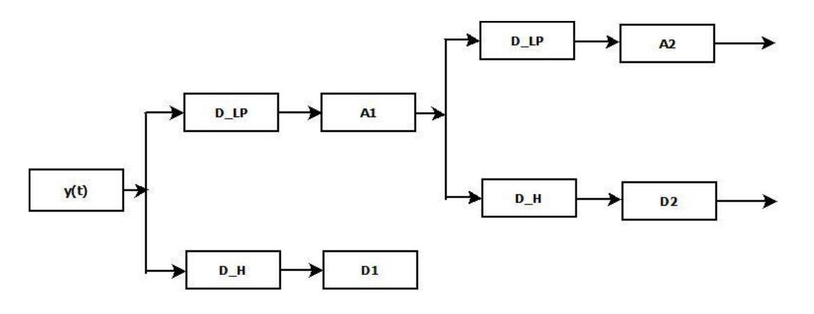

.. _preprocessing:

Pre Processing
==============
In order to improve and/or reduce the computational time needed, we implemented two
methods of pre processing the time series used. These can be found in the portfolioML.data.preprocessing
module.

| Scikit-learn package sklearn.decomposition.PCA is used for PCA (https://pywavelets.readthedocs.io/en/latest/)
| PyWavelets package is used for Discrete Wavelet Transform (https://scikit-learn.org/stable/modules/generated/sklearn.decomposition.PCA.html)

PCA - Principal Component Analysis
----------------------------------
Principal Component Analysis is a common way to reduce the dimensionality of the data
through a projection onto a less-dimensional space composed by the so-called principal
components, i.e. the eigenvectors of the covariance matrix of the data.

Our implementation articulates as follow:

| Starting from a 365-dimensional space (equal to the number of companies we tracked from
the available data of the S&P500 index in our entire period of study), we choosed to keep
the first 250 components that correspond to the eigenvectors of the covariance matrix
with the greatest eigenvalues. This resulted in a preserved variance of 0.94. Then, since
these orthogonal vectors are linear combinations of the ones from the higher dimensional
space, we selected the features that most contribute to them.

DWT - Discrete Wavelet Transform
--------------------------------
Discrete Wavelet Tranform (DWT) is a kind of time series decomposition that is able to extract
information from both time and frequency domain simultaneously at different scales.
Computationally speaking, it's implemented through a convolution of the signal with a low
pass filter (D_LP) and a high pass filter (D_H), respectively outputs the so-called approximations and
details coefficients on that particulat scale [1]_ .

In our study, because of the objective is to forcast the returns data of the following day,
we have applied the DWT to returns data over 3 time scales in order to keep only the "short-scale" information.
The following pictures rappresent respectively the DWT of price and returns (the one we have used),
in particular they contains the three details coefficients and the approximation on the last time-scale.

.. image:: images/dwtreturn.png
   :width: 400pt

.. image:: images/dwtprice.png
   :width: 400pt

[1]_  Jothimani, Dhanya and Yadav, Surendra S. and Shankar, Ravi, Discrete Wavelet Transform-Based Prediction of Stock Index: A Study on National Stock Exchange Fifty Index (2015). Journal of Financial Management and Analysis, Vol. 28(2), 2015, Available at SSRN: https://ssrn.com/abstract=2769529
